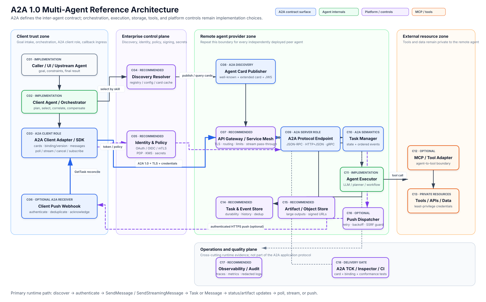

# A2A protocol implementation methodology for multi-agent systems

Research date: 2026-07-15  
Compatibility target: A2A protocol 1.0 (released specification 1.0.0)

## Executive recommendation

Treat A2A as the interoperability boundary between independently deployed, opaque agents. Keep planning, model execution, memory, MCP/tool use, and data access behind each agent's A2A server boundary.

For a first production implementation, use a centrally governed host/orchestrator with one official A2A client SDK, one standard binding, durable task and artifact stores, and independently deployed remote-agent services. Add a registry, multiple bindings, streaming, and push notifications only when requirements justify their extra operational and security cost.

A2A standardizes the external contract: Agent Cards, messages, parts, tasks, artifacts, task lifecycle, operations, bindings, version negotiation, streaming, push notifications, extensions, and declared security schemes. It does **not** standardize agent selection, planning, delegation graphs, internal workers, registry APIs, databases, queues, artifact storage, policy products, MCP/tool execution, or deployment topology. The normative source for data objects and request/response messages is [`specification/a2a.proto`](https://github.com/a2aproject/A2A/blob/main/specification/a2a.proto), alongside the [A2A 1.0 specification](https://a2a-protocol.org/latest/specification/).

## Reference architecture

Editable source: [`a2a-multi-agent-reference-architecture.drawio`](./a2a-multi-agent-reference-architecture.drawio)

The remote agent provider zone is a repeatable unit. A real multi-agent deployment contains one instance per independently owned or independently scaled peer agent. An application can act as both an A2A Client and an A2A Server, but its inbound server role must retain its own authorization and task-ownership boundary.

## Required and recommended components

| ID | Component | Status | Responsibility |
|---|---|---|---|
| C01 | Caller, UI, or upstream agent | Implementation | Supplies the goal, constraints, identity context, and consumes the assembled result. |
| C02 | Client agent / orchestrator | Implementation | Decomposes work, selects peers, correlates local workflow IDs with remote task IDs, applies retries/compensation, and assembles results. A2A does not prescribe this logic. |
| C03 | A2A client adapter / SDK | A2A role | Resolves Agent Cards, selects a declared interface, sends `A2A-Version: 1.0`, acquires credentials out of band, sends messages, tracks tasks, polls, streams, subscribes, cancels, and configures push delivery. |
| C04 | Discovery resolver / registry | Mixed | Fetches standardized Agent Cards. Direct configuration, well-known URLs, and curated registries are recognized strategies, but the registry API and ranking algorithm are not standardized. |
| C05 | Identity, policy, signing, and secrets | Recommended | Issues and validates OAuth/OIDC or workload credentials, enforces tenant/skill/action policy, and protects signing keys and callback secrets. |
| C06 | Client push webhook | Optional A2A receiver | Receives authenticated notification POSTs, validates task IDs, deduplicates deliveries, acknowledges with 2xx, and reconciles through `GetTask`. |
| C07 | API gateway / service mesh | Recommended | Provides TLS, routing, quotas, WAF controls, tenant routing, and unbuffered SSE or HTTP/2 pass-through. The A2A server still authorizes each operation. |
| C08 | Agent Card publisher | A2A contract | Publishes the public card at `/.well-known/agent-card.json` and optionally supplies an authenticated Extended Agent Card and JWS signatures. |
| C09 | A2A protocol endpoint | A2A role | Implements at least one standard binding—JSON-RPC, HTTP+JSON/REST, or gRPC—and validates version, media types, capabilities, extensions, authentication, and authorization. |
| C10 | Task manager / event hub | A2A semantics | Implements task operations and legal state transitions, maintains ordered task/status/artifact events, and coordinates polling, streaming, cancellation, and push. |
| C11 | Agent executor / domain logic | Implementation | Runs the model, planner, workflow, memory, and business logic; handles input-required/auth-required states; emits status and artifacts; and attempts cooperative cancellation. |
| C12 | MCP or tool adapter | Optional | Connects the remote agent to tools and resources. MCP is normally internal to the agent; A2A remains the agent-to-agent boundary. |
| C13 | Tools, APIs, and data | Private implementation | Performs domain actions with least-privilege credentials and action-level authorization. |
| C14 | Task and event store | Recommended | Durably stores tenant-scoped tasks, status transitions, history, push configurations, idempotency data, and recovery information. A2A defines visible state, not storage technology. |
| C15 | Artifact / object store | Recommended | Stores large or sensitive results and exposes authorized, expiring references. A2A defines `Artifact` and `Part`, not blob lifecycle or encryption. |
| C16 | Push dispatcher | Optional | Sends authenticated webhook notifications with timeout, retry/backoff, deduplication support, and SSRF-safe destination validation. |
| C17 | Observability and audit | Recommended | Correlates local workflow IDs with `contextId`, `taskId`, `messageId`, traces, metrics, redacted logs, and significant state/action audit events. |
| C18 | TCK, Inspector, and CI | Delivery gate | Validates Agent Cards, binding behavior, conformance, cross-SDK interoperability, reconnection, cancellation, duplicates, and security failure paths. |

The [A2A specification](https://a2a-protocol.org/latest/specification/) defines the client/server roles and data model. The [Agent Discovery guide](https://a2a-protocol.org/latest/topics/agent-discovery/) describes well-known, registry, and direct-configuration strategies. The [A2A and MCP guide](https://a2a-protocol.org/latest/topics/a2a-and-mcp/) defines the agent-to-agent versus agent-to-tool boundary.

## Implementation methodology

### 1. Pin the compatibility target

- Negotiate `A2A-Version: 1.0`; patch versions do not change wire compatibility.
- Pin the exact SDK/package patch used in the build and verify its compatibility matrix.
- Do not copy pre-1.0 examples blindly. A2A 1.0 changed operation names, Agent Card interfaces, stream-event discrimination, errors, and several fields. See [What's new in v1.0](https://a2a-protocol.org/latest/whats-new-v1/).

### 2. Identify real agent boundaries

Create a separate A2A server when a capability is autonomous, stateful, independently owned/scaled, or crosses a trust boundary. Keep deterministic, stateless functions as ordinary tools or MCP capabilities. Avoid turning every function into an agent.

### 3. Design Agent Cards before implementation

Define stable skill IDs, descriptions, examples, input/output media types, ordered `supportedInterfaces`, protocol version, security requirements, streaming/push support, required extensions, and optional signatures. Treat the card as a service contract, not marketing metadata. Keep secrets and sensitive skills out of the public card; use `GetExtendedAgentCard` for authenticated details. The standardized well-known location is documented in [Agent Discovery](https://a2a-protocol.org/latest/topics/agent-discovery/).

### 4. Model identity, ownership, and authorization

Decide whether calls carry workload identity, delegated end-user identity, or both. Define task ownership, tenant boundaries, per-skill scopes, action/data authorization, retention, and callback trust. Credentials are acquired out of band and transmitted through the selected binding's headers or metadata; normal A2A messages should not become a credential-forwarding channel. Production transport must use TLS, and authorization must be applied before protected task data is exposed. See [Enterprise Implementation](https://a2a-protocol.org/latest/topics/enterprise-ready/) and the [specification security sections](https://a2a-protocol.org/latest/specification/#7-authentication-and-authorization).

### 5. Choose one binding and the minimum delivery modes

Start with one declared binding:

- **HTTP+JSON/REST**: broad gateway/client compatibility.
- **JSON-RPC**: RPC-style integration and continuity with earlier A2A implementations.
- **gRPC**: strong typing and efficient internal streaming, with HTTP/2-aware infrastructure.

If multiple bindings are advertised, A2A requires semantically equivalent functionality, results, authentication, and errors across them. Polling with `GetTask` is the simplest async baseline. Add streaming for interactive latency and push only for disconnected/background clients. See [binding requirements](https://a2a-protocol.org/latest/specification/#5-protocol-binding-requirements-and-interoperability).

### 6. Build a thin protocol edge

Keep routes, serialization, binding-specific errors, version negotiation, authentication, authorization, capability validation, and media validation separate from domain execution. Use an official SDK where practical; this repository is Python-based, so the [official Python SDK](https://github.com/a2aproject/a2a-python) is the most direct local fit and currently exposes 1.0 support for the three standard bindings.

### 7. Implement a durable task state machine

Model the server-generated task ID, optional context grouping, messages, history policy, artifacts, timestamps, and terminal/interrupted states. Enforce legal transitions and caller/tenant visibility. Add message idempotency and commit task/artifact state before publishing its corresponding event, using a transactional outbox or equivalent consistency mechanism.

Messages are for conversational turns, clarification, and status; artifacts are durable task outputs. Transient messages are not a reliable recovery channel after a disconnect. Reconcile authoritative state with `GetTask`. See [multi-turn interactions](https://a2a-protocol.org/latest/specification/#34-multi-turn-interactions) and [messages and artifacts](https://a2a-protocol.org/latest/specification/#37-messages-and-artifacts).

### 8. Adapt the existing agent behind an executor

Expose an internal executor interface for start/continue, input-required, auth-required, cancellation, status events, and artifact events. Keep prompts, memory, model providers, planning, and tools opaque. The official Python SDK's [`AgentExecutor`](https://a2a-protocol.org/latest/sdk/python/api/a2a.server.agent_execution.agent_executor.html) and quickstart show this boundary.

### 9. Add tools and MCP behind the executor

Give the agent only the tools it requires. Use separate, audience-bound credentials and policy at each tool boundary. Do not publish the internal tool inventory merely because the agent is reachable through A2A. A2A and MCP are complementary: [A2A coordinates autonomous agents; MCP connects an agent to tools and resources](https://a2a-protocol.org/latest/topics/a2a-and-mcp/).

### 10. Implement update and artifact delivery safely

- **Polling:** always available as the recovery/reconciliation path.
- **Streaming:** preserve event order, disable proxy buffering, configure long-lived connection timeouts, and reconcile after any unexpected close.
- **Push:** authenticate every POST, validate the expected task ID, deduplicate, use bounded retry/backoff, and validate callback URLs at registration and delivery to prevent SSRF and DNS rebinding.
- **Artifacts:** inline small text/data; use short-lived, tenant-scoped URLs for large outputs; apply size/type validation, malware scanning where relevant, encryption, and retention.

The [specification's update mechanisms](https://a2a-protocol.org/latest/specification/#35-task-update-delivery-mechanisms) define polling, streaming, and push behavior. Push uses the same `StreamResponse` event forms and can produce duplicates.

### 11. Instrument the complete task graph

Propagate W3C trace context through HTTP or gRPC metadata. Correlate local orchestration IDs with remote context/task/message IDs without logging sensitive Parts or credentials. Measure request rate, errors, queue delay, task execution time, time in interrupted states, stream connections, webhook failures, artifact bytes, token/cost usage, and cancellation outcomes. The official [enterprise guidance](https://a2a-protocol.org/latest/topics/enterprise-ready/) recommends standard tracing, logs, metrics, audit events, and API management.

### 12. Verify before production and roll out incrementally

Run the official [A2A TCK](https://github.com/a2aproject/a2a-tck) for protocol conformance, [A2A Inspector](https://github.com/a2aproject/a2a-inspector) for card/request inspection, and [A2A ITK](https://github.com/a2aproject/a2a-itk) for cross-SDK, mixed-version, multi-hop, streaming, and push interoperability. Add application tests for tenant isolation, inaccessible-task behavior, duplicate messages/events, reconnect, cancellation races, large artifacts, invalid media types, required extensions, rate limits, webhook replay, SSRF, and partial downstream failure.

Begin with direct configuration and one or two remote agents. Introduce a curated registry only when dynamic discovery and governance justify it. Add more bindings only for verified consumers.

## Primary interaction flows

### Discovery and negotiation

1. The orchestrator derives the required skill, input/output media types, trust, and latency constraints.
2. The resolver returns configured candidates or queries a registry.
3. The A2A client fetches `https://{domain}/.well-known/agent-card.json`.
4. It validates TLS, card freshness, policy, and a JWS signature when required.
5. It chooses the first supported advertised interface, preserves any declared tenant routing value, and checks capabilities, security schemes, media types, extensions, and protocol version.
6. It obtains credentials out of band and sends the request to that interface.

### Task submission and execution

1. The client sends `SendMessage` or `SendStreamingMessage` with `A2A-Version: 1.0`, transport credentials, a client-generated message ID, Parts, output preferences, and optional execution configuration.
2. The gateway performs perimeter controls; the A2A server independently authenticates and authorizes the caller and validates the request.
3. The task manager persists a new task and dispatches the executor. The server generates the task ID.
4. The server returns either a direct `Message` for a simple interaction or a `Task` for stateful work.
5. The executor uses its private model, memory, and tools, then emits status and Artifact updates.
6. The client observes progress through polling, streaming, or push and reconciles the final Task.

### Cancellation

1. The client calls `CancelTask` for an accessible non-terminal task.
2. The server authorizes cancellation, records intent, and signals the executor.
3. The executor attempts cooperative cancellation and stops further side effects where possible.
4. The task manager returns the updated task. Cancellation can race with completion and does not roll back external side effects; compensation belongs to the orchestrator/domain workflow.

## Topology alternatives

| Approach | Advantages | Risks | Recommendation |
|---|---|---|---|
| Central host/orchestrator with modular peer-agent services | Simple governance, global workflow visibility, policy enforcement, and result assembly; clean per-agent trust boundaries | Orchestrator can become a bottleneck or single point of failure unless replicated | **Recommended production baseline** |
| Peer-to-peer choreography | High autonomy and fewer central bottlenecks | Harder loop detection, authorization-chain handling, compensation, audit, and global observability | Use only when decentralization is a real requirement |
| Shared multi-tenant A2A platform | Reuses gateways, policy, stores, SDK wrappers, and telemetry; lowers per-agent platform cost | Strong tenant isolation, noisy-neighbor risk, larger blast radius, complex routing | Good at enterprise scale after the modular model is proven |

Deployment can begin in one process for a proof of concept, but production agents should normally have stateless protocol adapters backed by durable task/event/artifact stores. Scale workers, streaming connections, and push dispatch independently.

## Common implementation failures

- Treating A2A as an internal sub-agent or tool-call protocol. Internal orchestration remains framework-specific; MCP is the normal tool boundary.
- Using the public Agent Card as a trusted registry record without validating TLS, freshness, signatures/policy, and authorization.
- Omitting `A2A-Version`, which can silently invoke 0.3 compatibility semantics on compliant servers.
- Advertising multiple bindings without testing functional equivalence.
- Keeping task state only in process memory, which breaks restarts, polling, resubscription, and horizontal scaling.
- Treating stream messages as durable; clients can miss transient events after disconnects.
- Forwarding user/tool credentials through multiple agents rather than issuing audience-bound credentials directly to the agent that needs them.
- Relying only on gateway authentication instead of authorizing every task operation in the A2A server.
- Ignoring reverse-ingress risk from push callbacks and outbound SSRF risk from client-supplied webhook or URL Parts.
- Assuming cancellation reverses already completed external actions.

## Primary sources

- [A2A protocol specification 1.0](https://a2a-protocol.org/latest/specification/)
- [Normative `a2a.proto`](https://github.com/a2aproject/A2A/blob/main/specification/a2a.proto)
- [What's new in A2A 1.0](https://a2a-protocol.org/latest/whats-new-v1/)
- [Agent Discovery](https://a2a-protocol.org/latest/topics/agent-discovery/)
- [Enterprise Implementation](https://a2a-protocol.org/latest/topics/enterprise-ready/)
- [A2A and MCP](https://a2a-protocol.org/latest/topics/a2a-and-mcp/)
- [Official Python SDK](https://github.com/a2aproject/a2a-python)
- [Official project SDK and samples index](https://github.com/a2aproject/A2A)
- [A2A TCK](https://github.com/a2aproject/a2a-tck)
- [A2A Inspector](https://github.com/a2aproject/a2a-inspector)
- [A2A ITK](https://github.com/a2aproject/a2a-itk)

## Version note

The official specification currently identifies the released protocol as 1.0.0, while wire negotiation uses only major/minor (`1.0`). Patch-level SDK and repository releases can move independently. Pin the exact SDK patches you test, send `A2A-Version: 1.0`, and treat the specification plus `a2a.proto` as the normative contract.
