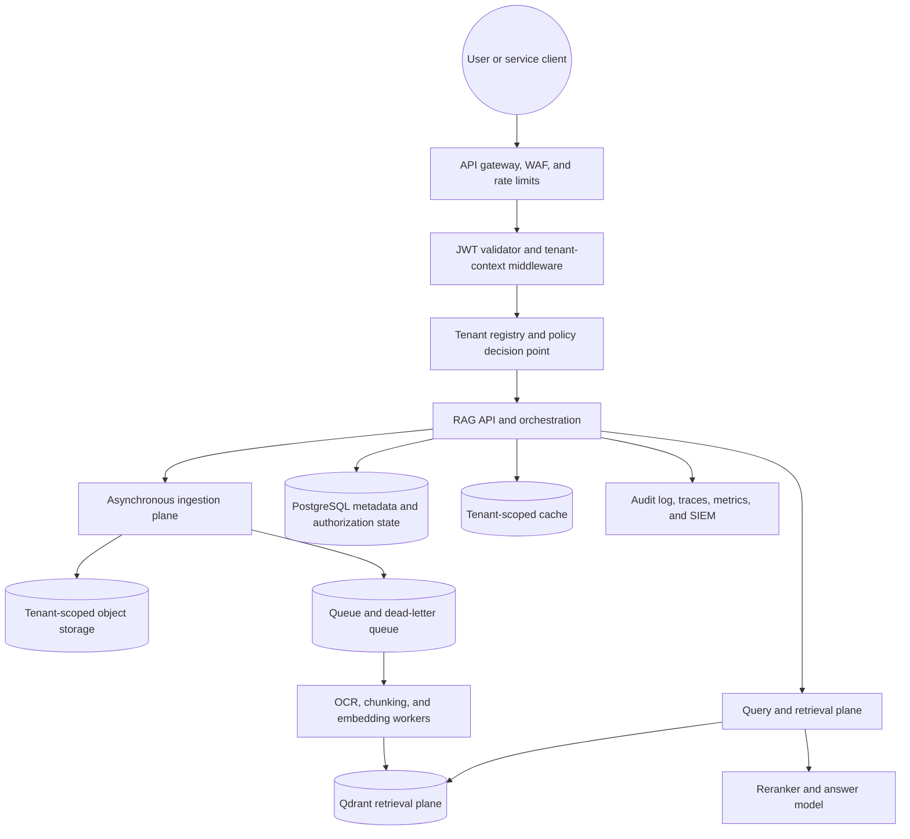

# Scalable Multi-Tenant RAG with Qdrant

- **Status:** Proposed
- **Date:** 2026-08-19
- **Scope:** Production reference architecture for tenant-aware ingestion and retrieval
- **Decision owner:** Platform architecture

## 1. Executive decision

Build a policy-enforced RAG platform in front of Qdrant. The public API validates an OAuth/OIDC access-token JWT, derives an immutable tenant context, and passes that context through every synchronous request and asynchronous job. Browsers, Streamlit pages, and partner clients never connect to Qdrant directly.

Use one Qdrant collection per embedding family, vector dimension, schema version, and residency pool—not one collection per tenant. Every point carries a `tenant_id`; that field is a keyword payload index with `is_tenant=true`; and every read, write, count, scroll, and delete is constructed by a tenant-scoped repository that injects the tenant and ACL filters.

Use Qdrant tiered multitenancy as the target topology:

- small tenants share a fallback shard;
- hot or large tenants are promoted to dedicated shard keys;
- regulated tenants that require a hard administrative, cryptographic, residency, or backup boundary use a dedicated cluster.

The same tenant payload filter remains mandatory even when a tenant has a dedicated shard. The shard selector improves routing and noisy-neighbor isolation; it is not the authorization control.

## 2. Assumptions

This design assumes:

- hundreds to tens of thousands of tenants;
- many small tenants and a small number of very large tenants;
- logical isolation is acceptable for the standard tier;
- some tenants may require regional or dedicated infrastructure;
- ingestion is write-heavy and asynchronous, while querying is latency-sensitive;
- one user may belong to more than one tenant, but each access token names one active tenant;
- source documents can contain confidential data and untrusted instructions.

If all tenants require hard isolation, the identity and service boundaries remain the same, but the Qdrant routing policy becomes cluster-per-tenant rather than tiered shared storage.

## 3. Current repository findings

The repository already contains useful pieces, but they are not an enforceable tenant boundary:

- `HybridSearch` creates a tenant-aware Qdrant payload index and applies a `tenant_id` search filter (`src/demo_ocr/processing/hybrid_search.py:74`, `src/demo_ocr/processing/hybrid_search.py:277`).
- The active tenant is hard-coded as `"1011"` during collection setup, ingestion, and querying (`src/demo_ocr/processing/ocr_page.py:757`, `src/demo_ocr/processing/ocr_page.py:1052`, `src/demo_ocr/processing/ocr_page.py:1072`).
- The invoice viewer connects directly to Qdrant and scrolls the entire collection without a tenant filter (`src/demo_ocr/invoice_viewer/invoice_viewer_page.py:49`, `src/demo_ocr/invoice_viewer/invoice_viewer_page.py:86`).
- The legal LightRAG proof of concept already preserves structured citations and explicitly identifies tenant isolation as a production gap (`legal_lightrag_poc/legal_rag_client.py:279`, `legal_lightrag_poc/README.md:209`).
- The repository pins `qdrant-client==1.15.1` (`requirements.txt:45`). Qdrant documents tiered multitenancy from v1.16.0 and per-tenant sparse IDF scoping from v1.19.0, so client/server compatibility must be upgraded and pinned before those features are used.
- Long-lived service credentials are present in application source. They must be rotated and moved to a secret manager before this design is exposed to users; values are intentionally omitted here.

The production system should reuse the citation behavior, OCR knowledge, and existing tenant payload concept, but not the direct-client, hard-coded-tenant, or static-credential patterns.

## 4. Logical architecture



### 4.1 Trust boundaries

1. **Internet boundary:** the gateway terminates TLS, applies WAF rules, creates a request ID, and performs coarse rate limiting.
2. **Identity boundary:** the auth middleware verifies the access-token JWT and constructs `TenantContext`. Merely base64-decoding claims is never sufficient.
3. **Application authorization boundary:** the policy layer confirms tenant membership, tenant state, scopes, document ACLs, residency, and quota.
4. **Data-access boundary:** only tenant-scoped repositories can call Qdrant, PostgreSQL, object storage, or caches.
5. **Model boundary:** retrieved documents are untrusted data. They cannot alter system policy, tool permissions, tenant context, or network access.

## 5. Identity and authentication

### 5.1 Token type and claims

Use an OAuth 2.0 access token for the API, not an OIDC ID token. A recommended tenant-scoped token profile is:

```json
{
  "iss": "https://idp.example.com/",
  "aud": "rag-api",
  "sub": "user_42",
  "tenant_id": "tenant_123",
  "scope": "rag:query rag:ingest",
  "roles": ["member"],
  "jti": "0198d3f0-...",
  "iat": 1787156000,
  "nbf": 1787156000,
  "exp": 1787156900
}
```

The IdP should mint a token for one active tenant. When a user switches tenant, use a token exchange or a server-validated membership flow that mints a new tenant-scoped token. Do not accept `X-Tenant-ID`, a body field, a query parameter, or a route field as an override for the token tenant.

Infrastructure placement, Qdrant shard tier, residency, retention, and encryption policy are mutable server-side attributes. They belong in the tenant registry, not in the JWT.

### 5.2 Validation algorithm

For every protected request:

1. Parse only `Authorization: Bearer <token>`.
2. Select a preconfigured trusted issuer; never follow a token-provided `jku`, issuer URL, or arbitrary key URL.
3. Resolve the signing key from a cached JWKS for that issuer.
4. Allowlist the configured signing algorithms; reject `none` and algorithm/key-type mismatches.
5. Verify the signature, `iss`, `aud`, `exp`, `nbf`, required `sub`, and required `tenant_id`.
6. Validate token type/profile so an ID token or token for another API cannot be substituted.
7. Normalize scopes, roles, and principal IDs through the policy layer.
8. Confirm the tenant is active and the subject is still a member for sensitive or revocation-sensitive operations.
9. Build an immutable `TenantContext`; discard unneeded raw claims.

Unknown signing keys trigger one bounded JWKS refresh and then fail closed. Cached keys may continue within a short, configured stale window during an IdP outage; tokens signed by an unknown key remain rejected.

### 5.3 Immutable tenant context

```text
TenantContext
  tenant_id        server-normalized tenant identifier
  subject_id       issuer-scoped user or workload identifier
  principal_ids    normalized user, group, and role principals
  scopes           allowed application actions
  token_id         jti for audit and revocation correlation
  issuer            validated issuer
  request_id       trace and audit correlation identifier
  policy_version   policy snapshot used for this decision
```

Synchronous services receive this as typed request context over authenticated internal connections. Queue messages carry the minimal context plus `tenant_id`, `document_id`, `job_id`, `policy_version`, and an integrity-protected envelope. Workers resolve current routing from the tenant registry; they do not trust a routing tier copied from the external token.

The raw external JWT is not forwarded to Qdrant or stored in job payloads, logs, or caches.

### 5.4 Authorization behavior

- Invalid, expired, or unverifiable token: `401`.
- Valid identity without the required scope, membership, or active tenant: `403`.
- Cross-tenant resource identifiers are looked up by `(tenant_id, resource_id)` and return a non-enumerating `404` when absent from that tenant.
- Admin or support cross-tenant access uses a separate, strongly authenticated break-glass flow with explicit target tenant, reason, expiry, and immutable audit—not a tenant-header override.

## 6. Service boundaries

### 6.1 Public data-plane APIs

- `POST /v1/rag/query`
- `POST /v1/documents/uploads` — create a tenant-bound upload and return a presigned destination
- `POST /v1/documents/{document_id}/ingestions`
- `GET /v1/documents/{document_id}`
- `DELETE /v1/documents/{document_id}`
- `GET /v1/ingestions/{job_id}`

The API derives tenant identity from `TenantContext`; normal endpoint parameters never select a tenant.

### 6.2 Control-plane APIs

Separate administrative endpoints manage tenant provisioning, quotas, retention, reindexing, collection aliases, shard promotion, regional placement, snapshots, and offboarding. End-user credentials cannot call them.

### 6.3 Qdrant access roles

Qdrant stays on a private network with TLS. Use separate, rotated service credentials:

- query service: collection read access;
- ingestion workers: collection read/write access;
- control plane: manage access;
- no Qdrant credential in a browser, Streamlit session, document, or queue message.

Qdrant JWT/RBAC is useful for cluster and collection permissions, but its documented access model does not inject a row-level tenant payload filter into shared-collection queries. Application-side tenant and ACL enforcement remains mandatory.

## 7. Storage model

### 7.1 Metadata database

PostgreSQL is the source of truth for:

- tenants, memberships, policies, quotas, and routing;
- documents, versions, ACLs, classifications, and retention state;
- ingestion jobs, idempotency keys, outbox events, and failure details;
- collection aliases, embedding versions, and corpus epochs;
- deletion and audit state.

All tenant-owned tables include `tenant_id`, use composite lookups, and enable row-level security as defense in depth. Application authorization is still required; RLS is not the only control.

### 7.2 Object storage

Store raw and normalized documents under server-generated paths such as:

```text
tenants/{tenant_id}/documents/{document_id}/versions/{version}/raw
tenants/{tenant_id}/documents/{document_id}/versions/{version}/normalized
```

Clients never choose the storage key. Apply encryption at rest, private endpoints, malware scanning, object versioning, and lifecycle policies. Regulated tiers can use tenant-specific KMS keys or a dedicated bucket/account.

### 7.3 Qdrant collections

Create versioned physical collections by embedding contract and residency pool, then expose stable aliases:

```text
alias: rag_text_current_eu
physical: rag_text_3072_schema_v3_eu_2026_08
```

Embedding model, vector dimension, distance function, sparse-vector behavior, and payload schema are collection-level contracts. Changing them creates a new collection and a blue/green reindex, followed by an alias cutover.

Recommended point payload:

```json
{
  "tenant_id": "tenant_123",
  "document_id": "doc_456",
  "document_version": 3,
  "chunk_id": "chunk_789",
  "corpus_id": "legal",
  "acl_principals": ["user:user_42", "group:legal"],
  "classification": "confidential",
  "status": "active",
  "source_ref": "tenants/tenant_123/documents/doc_456/versions/3/normalized",
  "page": 7,
  "embedding_version": "text-embedding-contract-v3",
  "content_hash": "sha256:...",
  "ingest_job_id": "job_abc",
  "effective_at": "2026-08-19T00:00:00Z",
  "expires_at": null,
  "text": "retrieval-ready chunk text"
}
```

The authoritative source remains object storage and PostgreSQL. Keeping retrieval-ready text in Qdrant payload minimizes query latency; a high-security tenant policy may instead keep only a source reference and fetch authorized text after retrieval.

Use globally unique deterministic point IDs derived from tenant, document, version, and chunk. This makes retries idempotent and avoids Qdrant's documented custom-sharding ambiguity when the same point ID appears under different shard keys.

### 7.4 Payload indexes

Index fields used in mandatory or selective filters:

- `tenant_id`: keyword with `is_tenant=true`;
- `document_id`, `corpus_id`, `status`, `classification`: keyword;
- `acl_principals`: keyword/multi-value;
- `effective_at`, `expires_at`, `document_version`: appropriate datetime/integer indexes.

If sparse search uses IDF, scope the IDF corpus to the validated tenant as well as applying the retrieval filter. Qdrant documents that payload partitioning alone does not isolate shard-wide term frequencies.

## 8. Qdrant tenancy and routing

### 8.1 Standard tier

Use a shared collection with a shared fallback shard. All points carry `tenant_id`, and every operation includes the mandatory tenant payload filter.

This is the most economical model for many small tenants and follows Qdrant's documented payload-partitioning guidance.

### 8.2 Hot-tenant tier

Promote a large or noisy tenant to a dedicated shard key within the same collection. In tiered mode, every upsert and query uses a shard selector with:

```text
target   = TenantContext.tenant_id
fallback = shared
```

The request also includes `tenant_id == TenantContext.tenant_id`. The tenant registry records promotion state for operations and observability, but request correctness does not depend on the caller knowing whether the dedicated shard exists.

### 8.3 Dedicated tier

Use a separate Qdrant cluster when a tenant requires any of:

- contractual or regulatory physical isolation;
- distinct data residency;
- tenant-owned encryption or network perimeter;
- independent backup/restore and deletion boundary;
- sustained workload that would dominate a shared cluster;
- an incompatible embedding or lifecycle policy.

A separate collection on the same cluster is an administrative boundary, not the same as a separate failure or network boundary.

### 8.4 Mandatory repository contract

Application code never receives a raw Qdrant client. The repository API requires `TenantContext`:

```text
search(context, query_vector, authorized_corpora, limit)
upsert_chunks(context, document_id, chunks)
delete_document(context, document_id)
count_document(context, document_id)
```

The repository constructs filters internally. It rejects attempts to remove, replace, or broaden mandatory conditions. User-provided filters may only narrow the result set.

Every retrieval filter includes:

- `tenant_id == context.tenant_id`;
- `status == active`;
- an authorized corpus/document scope;
- an ACL rule matching one of `context.principal_ids` or tenant-wide visibility;
- effective/expiry constraints where applicable.

`scroll`, `count`, `retrieve`, export, delete-by-filter, recommend, and grouped search receive the same enforcement. Maintenance jobs that cross tenant boundaries require a separate control-plane repository and audit policy.

## 9. Data flows

### 9.1 Ingestion

1. Gateway validates request shape, size, and rate limits.
2. Auth middleware verifies the JWT and builds `TenantContext`.
3. Policy authorizes `rag:ingest`, classification, corpus, and quota.
4. API allocates `document_id`, version, server-generated object key, and idempotency record.
5. Client uploads to a short-lived presigned URL bound to that object key and size/type constraints.
6. Scanner verifies MIME by content, malware status, size, and archive limits.
7. Transactional outbox publishes a tenant-bound ingestion job.
8. Sandboxed OCR/parser creates normalized text and layout metadata.
9. Chunker applies a versioned policy and records source offsets for citations.
10. Embedding workers batch by compatible model and fair-schedule across tenants.
11. Repository upserts deterministic points with tenant payload and shard routing, waiting for the configured durability acknowledgment.
12. PostgreSQL marks the document `ready` only after vector writes and citation metadata are complete.
13. Audit records actor, tenant, document, versions, model, collection alias, outcome, and trace ID.

Retries are idempotent. Poison messages go to a tenant-aware dead-letter queue. Partial vector writes are overwritten by the same deterministic IDs or removed during compensation.

### 9.2 Query and answer generation

1. Gateway applies per-tenant and per-subject rate limits.
2. Auth and policy build the validated context and allowed corpora/ACL principals.
3. Query embedder uses the embedding contract behind the active collection alias.
4. Tenant-scoped repository applies shard routing plus mandatory tenant, state, corpus, ACL, and time filters.
5. Qdrant returns candidates and retrieval metadata.
6. Service rechecks document state/ACL against authoritative metadata when required, protecting against stale vector payloads during deletion or ACL changes.
7. Reranker sees only tenant-authorized candidates.
8. Prompt builder labels retrieved chunks as untrusted evidence and prevents them from changing system policy or tool permissions.
9. Answer model receives the minimum necessary chunks.
10. Citation service resolves model markers against authoritative retrieval records; unknown or cross-tenant citations are rejected.
11. Response includes the answer, verified citations, query ID, and an abstention when evidence is insufficient.

If retrieval fails or returns no authorized evidence, the service does not silently fall back to the model's general knowledge for a grounded endpoint.

### 9.3 Deletion and offboarding

1. Mark the document or tenant `deleting` in PostgreSQL so policy blocks new reads/writes.
2. Invalidate tenant/corpus cache epochs.
3. Remove or deactivate Qdrant points with a tenant-and-document filter and wait for acknowledgment.
4. Delete normalized and raw objects according to retention/legal-hold policy.
5. Verify no active vector points remain.
6. Record an auditable deletion result; retain only allowed tombstone metadata.

For dedicated shards or clusters, offboarding may remove the entire shard/cluster after the verification and retention gates.

## 10. Caching

Every retrieval or answer cache key includes at least:

```text
tenant_id
hash(normalized principal and ACL set)
query or query-embedding hash
retrieval parameters
embedding version
collection alias target
corpus epoch
policy version
```

Never key solely by query text, user ID, or raw token. Do not share cached retrieved chunks across tenants. Increment the corpus epoch on ingestion, deletion, ACL change, reindex cutover, or tenant routing migration.

## 11. Scalability and availability

### 11.1 Stateless services and queues

- Autoscale gateway, auth middleware, RAG API, and query workers on latency and concurrency.
- Autoscale OCR/embedding workers on queue lag, while enforcing tenant quotas and fair scheduling.
- Use bounded batches, backpressure, idempotency keys, retries with jitter, and dead-letter queues.
- Separate query and ingestion concurrency pools so large imports cannot starve interactive search.

### 11.2 Qdrant cluster

For self-hosted production, begin with at least three voting nodes across failure domains; a two-node Raft cluster cannot retain a majority after one failure. Use replication factor 2 or greater and validate shard count, memory, disk IOPS, HNSW parameters, quantization, and payload index cost with representative tenant distributions.

For sensitive ingestion, use an acknowledgment policy that matches the required durability, such as replication factor 2 with write consistency factor 2. Keep jobs idempotent because a failed distributed write can be partially applied and must be retried. Use stronger read consistency only for workflows that require it; ordinary queries may begin only after the ingestion job is marked ready.

Run automated snapshots, store them outside the cluster, encrypt them, and perform restore drills. Qdrant documents snapshot restore compatibility across the same or next minor version, so upgrades and restore procedures must be tested together.

### 11.3 Regional cells

Deploy a complete data-plane cell per residency region: API, queue, workers, PostgreSQL, object storage, cache, and Qdrant. The global control plane stores routing and policy metadata but does not fan out tenant queries across regions. The gateway resolves the tenant's region after validating identity and routes to that cell.

## 12. Security controls

- Private Qdrant network, TLS, least-privilege service credentials, rotation, and audit logging.
- No direct Qdrant access from UI code; no unfiltered collection-wide user export.
- Secrets in a secret manager; no credentials in source, images, logs, or client bundles.
- PostgreSQL RLS, composite tenant/resource lookups, and server-generated object keys.
- MIME sniffing, malware scanning, archive-bomb limits, sandboxed OCR/parsers, and sanitized display names.
- URL ingestion disabled by default. If enabled, use an allowlist, restricted egress proxy, DNS/IP validation, redirect limits, private/link-local address blocking, and size/time limits.
- Retrieved text is untrusted. It cannot grant tools, change system instructions, choose network targets, or alter tenant filters.
- Model/provider egress is allowlisted; tenant policy controls whether document text may leave the region or platform.
- Query, chunk, and token bodies are not logged by default. Audit logs record identifiers, hashes, policy decisions, and versions.
- Qdrant request IDs propagate through `x-request-id`/trace context for audit correlation.

## 13. Failure behavior

- JWT validation or tenant-policy uncertainty: fail closed.
- Qdrant unavailable: return a retriable `503`; do not generate an ungrounded answer.
- Embedding contract mismatch: reject the job/query and surface an operator alert.
- Model unavailable after retrieval: optionally return authorized context-only results; otherwise return a retriable error.
- Queue duplicate: idempotent no-op or deterministic overwrite.
- Stale ACL/vector payload: post-retrieval metadata recheck removes unauthorized candidates.
- Dedicated-shard promotion in progress: fallback routing plus tenant filter preserves correctness; migration state controls operational retries.
- Cache uncertainty: bypass the cache, never broaden authorization.

## 14. Observability and audit

Trace the full chain with `request_id`, `query_id`, `job_id`, `tenant_id`, and model/index versions. Record:

- authentication and policy decisions;
- ingestion stage latency, queue lag, failures, and retry count;
- Qdrant query/upsert latency, shard route, result count, and timeout rate;
- retrieval relevance, empty-result rate, citation validity, and abstention rate;
- tenant quota consumption and noisy-neighbor indicators;
- cache hit/miss by tier and corpus epoch;
- Qdrant replica, shard, disk, memory, optimizer, and snapshot health.

Avoid unbounded tenant IDs as Prometheus labels. Use tier/region for metrics and place tenant identifiers in access-controlled logs and traces.

Alert on any operation that reaches a tenant-scoped repository without context, any filter-invariant failure, repeated authorization denials, unfiltered admin operations, or mismatched tenant IDs in returned payloads.

## 15. Verification strategy

### 15.1 Non-negotiable invariants

1. A token for tenant A can never search, retrieve, scroll, count, export, cite, update, or delete tenant B data.
2. Omitting tenant context fails the call; it never widens a query.
3. User filters can narrow mandatory filters but cannot replace or negate them.
4. Dedicated-shard routing still applies the tenant payload filter.
5. Queue messages with altered tenant/document bindings are rejected.
6. Cache entries are not reusable across different tenant or ACL contexts.
7. A document marked deleting/inactive is not sent to reranking or generation.
8. Model-authored citation labels resolve only to retrieved, authorized chunks.

### 15.2 Test layers

- Unit tests for JWT profile validation, claim normalization, filter composition, cache keys, and policy failures.
- Property tests proving arbitrary optional filters cannot remove mandatory tenant/ACL predicates.
- Two-tenant integration tests for every Qdrant method, including `scroll`, `count`, group, recommend, delete, and export paths.
- Contract tests for IdP key rotation, audience/type substitution, expired/not-yet-valid tokens, and multi-tenant membership switching.
- Replay and tampering tests for asynchronous job envelopes and idempotency.
- SSRF, malicious-file, archive-bomb, parser-sandbox, and prompt-injection tests.
- Load tests with skewed tenants to establish promotion thresholds and quota behavior.
- Chaos tests for Qdrant node loss, queue redelivery, IdP/JWKS outage, and partial vector writes.
- Backup, regional recovery, alias rollback, shard promotion, and deletion-verification drills.

## 16. Migration from this repository

### Phase 0 — contain current risk

- Rotate hard-coded credentials and remove them from source/history according to the organization's incident process.
- Prevent direct network access to Qdrant except from approved services.
- Disable or restrict the unfiltered invoice-viewer scroll path.

### Phase 1 — establish the trust boundary

- Add a dedicated RAG API with JWT verification and immutable `TenantContext`.
- Put Streamlit behind the gateway and change it to call the API.
- Introduce separate query, ingestion, and control-plane Qdrant credentials.

### Phase 2 — tenant-aware repositories and metadata

- Replace direct `QdrantClient` usage with a tenant-scoped repository.
- Add PostgreSQL tenant/document/job metadata and object storage.
- Adopt a citation-grade chunk payload and authoritative source mapping.
- Backfill/reindex existing data into a versioned collection and cut over via alias.

### Phase 3 — scale and isolation tiers

- Upgrade and pin compatible Qdrant server/client versions.
- Enable tenant payload indexing and tiered fallback routing.
- Promote hot tenants based on measured vector count, QPS, latency, and resource use.
- Add dedicated regional clusters for contractual isolation.

### Phase 4 — production assurance

- Add policy regression tests, audit/SIEM, quotas, prompt-injection controls, restore drills, deletion verification, and tenant-level RAG evaluations.

## 17. Alternatives considered

### Shared collection with payload filtering only

- **Advantages:** lowest operational overhead; good for many small tenants; works with the repository's current tenant index concept.
- **Disadvantages:** noisy-neighbor risk; every request depends on filter enforcement; no physical boundary.
- **Use:** safe first production increment while tiered routing is being validated.

### Tiered shared collection — recommended target

- **Advantages:** one embedding/schema contract; economical shared fallback; dedicated shards for hot tenants; tenant promotion without a collection-per-tenant explosion.
- **Disadvantages:** requires compatible Qdrant versions and shard-selector discipline; still not a hard network/failure boundary.
- **Use:** default SaaS architecture under the stated assumptions.

### Collection or cluster per tenant

- **Advantages:** strongest administrative isolation; simpler tenant-specific backup, schema, and deletion boundaries.
- **Disadvantages:** high collection/shard overhead, operational sprawl, poor economics for many small tenants. A collection on a shared cluster still shares the failure and network boundary.
- **Use:** dedicated cluster only for explicit compliance, residency, encryption, or scale requirements.

## 18. Isolation policy decision

Adopt the following default tenant classes:

- **standard:** shared fallback shard plus mandatory filters;
- **scale:** dedicated shard plus mandatory filters;
- **regulated:** dedicated regional cluster plus mandatory application authorization.

Place a tenant in the regulated class when any binding requirement calls for a distinct residency boundary, customer-specific network perimeter or encryption ownership, independent backup/restore and deletion evidence, or a smaller incident blast radius. Promote a standard tenant to the scale class when measured vector count, QPS, latency, or resource use crosses load-tested operational thresholds. Those thresholds are configuration informed by capacity tests, not a change to the architecture.

Exceptions require an explicit control-plane policy record and architecture/security approval. Isolation class changes cost, placement, backups, deletion evidence, and incident blast radius; it never changes the JWT trust model or the tenant-scoped repository invariant.

## 19. Primary references

- [Qdrant multitenancy](https://qdrant.tech/documentation/manage-data/multitenancy/)
- [Qdrant security and access control](https://qdrant.tech/documentation/security/)
- [Qdrant horizontal scaling](https://qdrant.tech/documentation/scaling/horizontal-scaling/)
- [Qdrant consistency guarantees](https://qdrant.tech/documentation/scaling/consistency-guarantees/)
- [Qdrant snapshots](https://qdrant.tech/documentation/snapshots/)
- [RFC 8725: JWT Best Current Practices](https://www.rfc-editor.org/info/rfc8725/)
- [RFC 7519: JSON Web Token](https://www.rfc-editor.org/info/rfc7519/)
- [OWASP Multi-Tenant Security Cheat Sheet](https://cheatsheetseries.owasp.org/cheatsheets/Multi_Tenant_Security_Cheat_Sheet.html)
