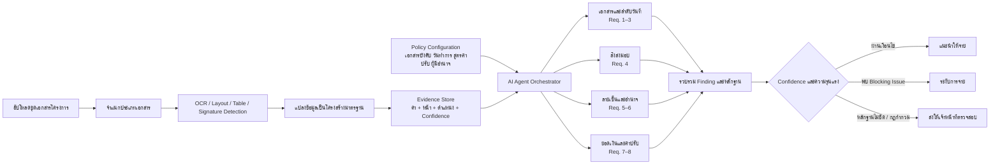
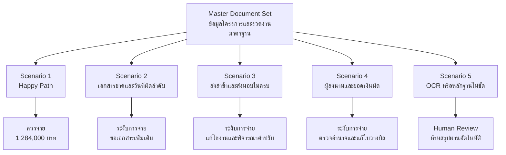
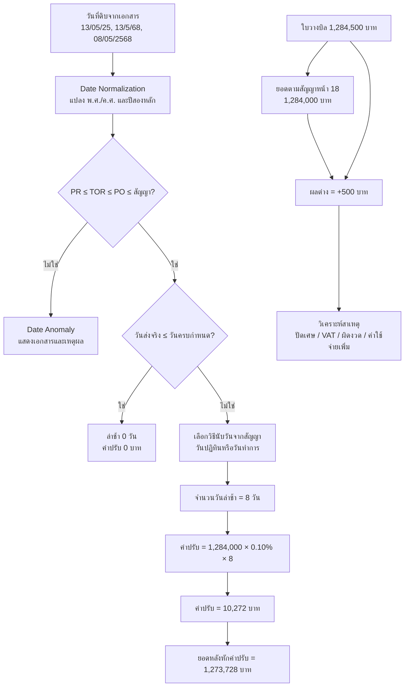
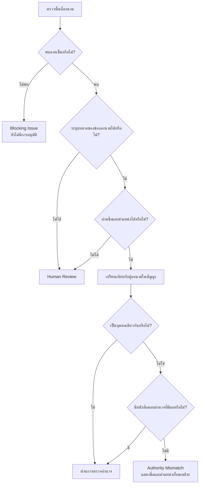
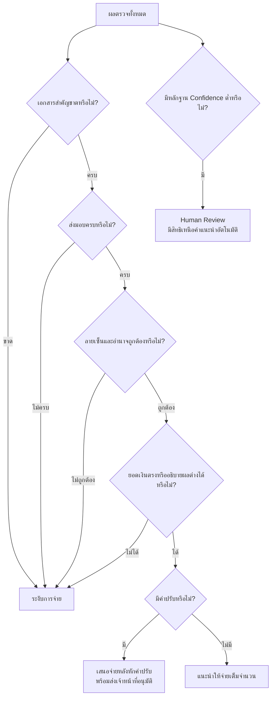

# Hybrid Scenario Pack: AI Agent สำหรับตรวจสอบเอกสารประกอบการอนุมัติโครงการ

แนวทางที่เหมาะกับ POC คือ “Hybrid Scenario Pack” ใช้ชุดเอกสารโครงการเดียวเป็นต้นแบบ แล้วสร้างสำเนา 5 สถานการณ์โดยแก้ข้อมูลบางจุด วิธีนี้ทดสอบครบทั้ง 9 requirements และเปรียบเทียบผลของระบบได้ง่าย

> หมายเหตุ: สูตรและอัตราค่าปรับด้านล่างเป็นข้อมูลสมมติสำหรับ POC ต้องตั้งค่าให้ตรงกับสัญญาและระเบียบจริงก่อนใช้งาน

## 1. ภาพรวมระบบตรวจสอบเอกสาร

จุดสำคัญคือให้ AI ใช้สำหรับอ่านเอกสาร จับคู่ข้อมูล และอธิบายเหตุผล ส่วนการคำนวณวันที่ ยอดเงิน และค่าปรับควรใช้กฎแบบ deterministic เพื่อให้ตรวจสอบย้อนหลังได้

## 2. ชุดข้อมูลโครงการสมมติ

โครงการ: “ระบบตรวจสอบเอกสารอัตโนมัติ”

- มูลค่าสัญญา: 3,210,000 บาท รวม VAT
- งวดที่ตรวจสอบ: งวดที่ 2 จำนวน 40% หรือ 1,284,000 บาท
- กำหนดส่ง: 30 มิถุนายน 2569
- วิธีนับระยะเวลา: ทุกวันตามปฏิทิน
- ค่าปรับสมมติ: 0.10% ของมูลค่างวดต่อวัน
- เงื่อนไขงวดที่ 2 อยู่หน้า 18–19 ของสัญญา
- สิ่งที่ต้องส่งมอบ:

  1. ระบบตรวจสอบเอกสาร Version 1
  2. รายงานผลการทดสอบครบ 9 หัวข้อ
  3. คู่มือและการอบรมผู้ดูแลระบบ

เอกสารบังคับประกอบด้วย PR, TOR, PO, สัญญา, หนังสือส่งมอบ, รายงานการตรวจรับ และใบวางบิล ส่วนหนังสือมอบอำนาจเป็นเอกสารบังคับแบบมีเงื่อนไขเมื่อผู้ลงนามไม่ใช่บุคคลเดียวกับผู้ลงนามในสัญญา

## 3. Scenario Pack

| Scenario | ข้อมูลที่แก้ไข | ผลที่ระบบควรตรวจพบ | Requirements |
|---|---|---|---|
| 1: Happy Path | เอกสารครบ วันที่ถูกต้อง ส่ง 29 มิ.ย. ยอดตรง ลายเซ็นถูกต้อง | ผ่านทุกหัวข้อ ไม่มีค่าปรับ แนะนำให้จ่าย | 1–9 |
| 2: Missing & Date Anomaly | ไม่มี TOR และรายงานตรวจรับ; PO ลงวันที่ก่อน PR | แสดงรายการเอกสารที่ขาด อธิบายว่ากระบวนการจัดซื้อผิดลำดับ | 1, 2, 5, 9 |
| 3: Late & Incomplete | ส่งวันที่ 8 ก.ค.; รายงานตรวจรับไม่พบคู่มือและหลักฐานอบรม | ล่าช้า 8 วัน ส่งมอบไม่ครบ คำนวณค่าปรับพร้อมอ้างอิงหน้า 18–19 | 3, 4, 8, 9 |
| 4: Signer & Amount Mismatch | ผู้อนุมัติเป็นรองผู้อำนวยการแต่ไม่มีหนังสือมอบอำนาจ; ใบวางบิล 1,284,500 บาท | แสดงชื่อ/ตำแหน่งเปรียบเทียบ และผลต่างยอดเงิน +500 บาท | 5, 6, 7, 9 |
| 5: OCR Ambiguity | ปี พ.ศ./ค.ศ. ปะปน ตราประทับทับตาราง ลายเซ็นอ่านชื่อไม่ได้ | ระบุข้อมูลที่ไม่มั่นใจ พร้อมหน้าและตำแหน่ง ส่ง Human Review | ครอบคลุมทุกข้อในมิติความน่าเชื่อถือ |

## 4. การตรวจวันที่ ส่งมอบ ยอดเงิน และค่าปรับ

ใน Scenario 3 แม้คำนวณยอดหลังหักค่าปรับได้ แต่เมื่อสิ่งส่งมอบไม่ครบ ระบบควรแนะนำ “ระงับการจ่าย” จนกว่าจะส่งมอบครบ ไม่ควรแนะนำให้จ่ายยอดสุทธิโดยอัตโนมัติ

## 5. การตรวจลายเซ็นและผู้มีอำนาจ

ควรแยกสถานะ “พบลายเซ็น” ออกจาก “ระบุตัวบุคคลได้” และ “ยืนยันอำนาจแล้ว” เพราะการพบรอยลายเซ็นไม่ได้หมายความว่าเอกสารได้รับอนุมัติอย่างถูกต้อง

## 6. Logic สำหรับคำแนะนำสุดท้าย

ผลลัพธ์ทุก Finding ควรมีอย่างน้อย:

- สถานะ `Pass / Warning / Fail / Needs Review`
- ค่าที่พบจากเอกสารแต่ละฉบับ
- เลขหน้าและกรอบตำแหน่งของหลักฐาน
- ระดับความเชื่อมั่น OCR
- กฎที่ใช้ตัดสิน
- วิธีคำนวณ
- เหตุผลและสิ่งที่ต้องดำเนินการต่อ

จากภาพตัวอย่างใน repository ควรใส่ Test Case เรื่องปี พ.ศ./ค.ศ., ตราประทับทับตาราง, ช่องผู้ตรวจว่าง, ลายเซ็นที่อ่านชื่อไม่ได้ และ comma/decimal ของยอดเงินไว้ใน POC ด้วย เพราะเป็นความเสี่ยงที่พบได้จริงจากเอกสารตัวอย่าง
